# 🎬 Real-Time Sync Media Server (YouTube + Local Media + PDF Sync + Chat)

A self-hosted, lightweight Node.js server designed to synchronize media playback and document presentations in real-time across multiple client devices on a local network. One device acts as the **Host Controller** to drive the experience (play, pause, seek, load files, navigate slides, annotate), while spectator devices connect as **Clients** for synchronized real-time viewing.

---

> [!NOTE]
> 📖 **Official Documentation Website:** Visit [rmsdocs.netlify.app](http://rmsdocs.netlify.app/) for comprehensive setup guides, deployment details, and API documentation.

---

## 📌 Table of Contents

- [🚀 Key Features](#key-features)
- [📐 System Architecture & Workflow](#system-architecture--workflow)
- [📂 Project Directory Map](#project-directory-map)
- [🛠️ Installation & Configuration](#installation--configuration)
  - [Prerequisites](#prerequisites)
  - [Setup Instructions](#setup-instructions)
  - [Auto-Configuring Network IPs](#auto-configuring-network-ips)
- [🔌 REST API Documentation](#rest-api-documentation)
  - [1. QR Code Services](#1-qr-code-services)
  - [2. Session & Client Metrics](#2-session--client-metrics)
  - [3. Uploads & Asset Management](#3-uploads--asset-management)
- [⚡ WebSocket Event Protocol API](#websocket-event-protocol-api)
  - [1. Connection & Identity Control](#1-connection--identity-control)
  - [2. Media Sync & Playback Commands](#2-media-sync--playback-commands)
  - [3. PDF Slides & Live Presentation Tools](#3-pdf-slides--live-presentation-tools)
  - [4. Real-Time Chat Room Emitters](#4-real-time-chat-room-emitters)
- [🐛 Troubleshooting & Sync Calibration](#troubleshooting--sync-calibration)

---

## <a id="key-features"></a>🚀 Key Features

*   **📺 YouTube Sync:** Load and control any YouTube video using a standard URL or 11-character video ID.
*   **📁 Local Video & Audio Streaming:** Upload media files directly from the controller device. The server hosts and streams them with custom HTTP byte-range support.
*   **📄 PDF/Presentation Slide Sync:** Upload PDF documents (e.g., exported slides) and synchronize:
    *   Slide page navigation (Next, Previous, direct page jump).
    *   Viewport zoom levels (50% to 200%).
    *   Drawing tool overlays (synchronized pen brush strokes with custom colors and brush sizes).
    *   Real-time laser pointer coordinates tracking.
    *   One-click annotation canvas clear and scroll offset synchronization.
*   **🛡️ Client Admission Gatekeeper:** Gated access control. New clients enter a pending state and must be explicitly approved or rejected by the Host Controller. Hosts can also kick and ban clients by IP.
*   **👑 Single-Host IP Arbitration:** Enforces exactly one controlling Host per IP address. Additional controllers from the same IP are view-only. If the Host controller disconnects, other controllers on the same IP are automatically promoted.
*   **💬 Real-Time Chat Engine:** Integrated sidebar chat inside client and controller panels, as well as a standalone chat view, allowing all participants to communicate.
*   **📱 WiFi Hotspot & Connection QR Codes:** Auto-generates QR codes for connecting to the server's local WiFi and directly accessing the client/controller pages.
*   **📝 Automated Session Logging:** Logs all server activity (joins, play/seek commands, uploads, chat history) and saves a structured timestamped report to the server root upon graceful shutdown.
*   **👁️ Upload Watcher Service:** Monitors the `/uploads` directory using a filesystem watcher. It auto-updates the index and shuts down playback automatically if the currently playing file is removed.

---

## <a id="system-architecture--workflow"></a>📐 System Architecture & Workflow

The following comprehensive sequence diagram illustrates the entire system lifecycle: from gated connection admission and single-host promotion to media control, PDF presentation tools, and chat messaging.

```mermaid
sequenceDiagram
    autonumber
    actor Client as Spectator Client
    actor Host as Host Controller
    actor Backup as Secondary Controller
    participant Server as Sync Server

    %% Phase 1: Connection & Gated Admission
    rect rgb(30, 30, 40)
        Note over Client, Server: Phase 1: Connection & Gated Admission
        Client->>Server: HTTP Handshake / Socket Connection
        Client->>Server: emit("identify", { role: "client", name: "Guest" })
        Note over Server: Check IP blocklist & place in pending registry
        Server->>Client: emit("waiting_for_permission")
        Server->>Host: emit("join_request", { socketId, name, ip })
        Server->>Host: emit("pending_count", { count })
        Host->>Server: emit("approve_client", { socketId })
        Note over Server: Promote to active registry
        Server->>Client: emit("permission_granted")
        Server->>Client: emit("current_state", currentState)
        Server->>Host: emit("join_request_resolved", { socketId, approved: true })
        Server->>Host: emit("device_list", activeDevices)
    end

    %% Phase 2: Single-Host IP Arbitration
    rect rgb(45, 30, 30)
        Note over Host, Backup: Phase 2: Single-Host IP Arbitration (Same IP Address)
        Host->>Server: emit("identify", { role: "controller", name: "Controller A" })
        Note over Server: First controller on this IP becomes HOST
        Server->>Host: emit("host_status", { isHost: true })
        Backup->>Server: emit("identify", { role: "controller", name: "Controller B" })
        Note over Server: Secondary controller on same IP becomes VIEW-ONLY
        Server->>Backup: emit("host_status", { isHost: false })
        Note over Host, Server: If Host disconnects, promote secondary controller
        Host->>Server: Disconnects
        Server->>Backup: emit("host_status", { isHost: true })
    end

    %% Phase 3: Media Sync & Control Flow
    rect rgb(30, 45, 30)
        Note over Host, Client: Phase 3: Media Operations & Playback Sync
        Host->>Server: emit("command", { type: "load", mediaType: "local_video", fileUrl: "..." })
        Note over Server: Update Authoritative State
        Server->>Client: emit("command", { type: "load", mediaType: "local_video", ... })
        Server->>Host: emit("command", { type: "load", mediaType: "local_video", ... })
        Host->>Server: emit("command", { type: "play" })
        Server->>Client: emit("command", { type: "play" })
        Server->>Host: emit("command", { type: "play" })
        Host->>Server: emit("command", { type: "seek", time: 120 })
        Server->>Client: emit("command", { type: "seek", time: 120 })
        Server->>Host: emit("command", { type: "seek", time: 120 })
    end

    %% Phase 4: PDF Presentation Sync
    rect rgb(30, 45, 45)
        Note over Host, Client: Phase 4: PDF Presentation & Presentation Tools
        Host->>Server: emit("command", { type: "load", mediaType: "pdf", fileUrl: "..." })
        Server->>Client: emit("command", { type: "load", mediaType: "pdf", ... })
        Host->>Server: emit("pdf_page", { page: 4 })
        Server->>Client: emit("pdf_page", { page: 4 })
        Host->>Server: emit("pdf_draw", { startX, startY, endX, endY, color, width })
        Server-->>Client: broadcast("pdf_draw", strokeData)
        Host->>Server: emit("pdf_laser", { x, y, visible: true })
        Server-->>Client: broadcast("pdf_laser", laserData)
    end

    %% Phase 5: Real-time Chat Messaging
    rect rgb(45, 45, 45)
        Note over Client, Host: Phase 5: Real-Time Chat Engine
        Client->>Server: emit("identify_chat", { name: "Guest", role: "client" })
        Server->>Client: emit("chat_online_count", count)
        Client->>Server: emit("chat_send", { message: "Hello!" })
        Server->>Client: emit("chat_broadcast", chatMessage)
        Server->>Host: emit("chat_broadcast", chatMessage)
    end
```



---

## <a id="project-directory-map"></a>📂 Project Directory Map

```
Media_Sync/
├── config.json               # WiFi and hotspot configuration details
├── package.json              # Node dependencies and project scripts
├── server.js                 # Express web server & Socket.IO coordination
├── README.md                 # Project documentation
├── LICENSE                   # Project license
├── uploads/                  # Storage directory for local video, audio, and PDF uploads
└── public/                   # Client-side web assets
    ├── client.html           # Media player & presentation display page
    ├── controller.html       # Management board for session hosts
    └── chat.html             # Standalone chat system page
```

---

## <a id="installation--configuration"></a>🛠️ Installation & Configuration

### Prerequisites
*   [Node.js](https://nodejs.org/) (v16+ recommended)
*   All devices must connect to the same WiFi Router or Mobile Hotspot.

### Setup Instructions

1. **Install Dependencies:**
   In your root project directory, run:
   ```bash
   npm install
   ```

2. **Establish Config File (`config.json`):**
   Create a `config.json` file in the project root containing your hotspot parameters:
   ```json
   {
     "WIFI_SSID": "My_Hotspot_SSID",
     "WIFI_PASSWORD": "My_Hotspot_Password",
     "HOTSPOT_IP": "192.168.1.100"
   }
   ```

3. **Start the Server:**
   Launch the sync instance:
   ```bash
   npm start
   ```
   *For development with hot-reload:*
   ```bash
   npm run dev
   ```

4. **Access the Application:**
   Upon starting, a terminal console banner displays connection endpoints:
   *   **Host URL:** `http://<your-ip>:8000/controller.html`
   *   **Client URL:** `http://<your-ip>:8000/client.html`
   
   Open the Controller URL on your host device (e.g., phone or computer) and scan the QR code to connect spectator devices.

### Auto-Configuring Network IPs

To find your computer's IP address on the network:
*   **Windows:** Run `ipconfig` in Command Prompt and check the `IPv4 Address` under your active network adapter.
*   **macOS/Linux:** Run `ifconfig` or `ip a` in the terminal.

---

## <a id="rest-api-documentation"></a>🔌 REST API Documentation

The server exposes HTTP endpoints for managing uploads, configuration QR codes, and retrieving connection metrics.

### 1. QR Code Services

#### Get WiFi QR Code
*   **Endpoint:** `GET /api/wifi-qr`
*   **Purpose:** Returns a base64 PNG data URL representing the credential payload for device WiFi auto-connection.
*   **Response (`200 OK`):**
    ```json
    {
      "qrCode": "data:image/png;base64,iVBORw0KGgoAAA...",
      "ssid": "My_Hotspot_SSID"
    }
    ```

#### Get Connection URLs QR Code
*   **Endpoint:** `GET /api/connection-qr`
*   **Purpose:** Generates QR codes pointing directly to the Client and Controller pages.
*   **Response (`200 OK`):**
    ```json
    {
      "controllerQR": "data:image/png;base64,...",
      "clientQR": "data:image/png;base64,...",
      "urls": {
        "controller": "http://192.168.1.100:8000/controller.html",
        "client": "http://192.168.1.100:8000/client.html"
      }
    }
    ```

---

### 2. Session & Client Metrics

#### System Metrics Status
*   **Endpoint:** `GET /api/status`
*   **Purpose:** Overall metrics overview of the active session.
*   **Response (`200 OK`):**
    ```json
    {
      "clients": 4,
      "controllers": 1,
      "currentMedia": {
        "mediaType": "youtube",
        "videoId": "dQw4w9WgXcQ",
        "fileUrl": null,
        "fileName": null,
        "time": 45.2,
        "isPlaying": true,
        "volume": 80,
        "isMuted": false,
        "lastUpdate": 1716634812304
      },
      "uploadedFiles": 3,
      "uptime": 1240.5,
      "serverTime": "2026-05-25T10:50:00.000Z"
    }
    ```

#### Active Clients List
*   **Endpoint:** `GET /api/clients`
*   **Response (`200 OK`):**
    ```json
    {
      "clients": [
        {
          "id": "abc_123_SocketID",
          "ip": "192.168.1.105",
          "connectedAt": "2026-05-25T10:45:00.000Z",
          "lastSeen": 1716634810000
        }
      ],
      "count": 1
    }
    ```

#### Health Check
*   **Endpoint:** `GET /health`
*   **Response (`200 OK`):**
    ```json
    {
      "status": "healthy",
      "uptime": 1240.5,
      "clients": 4,
      "controllers": 1,
      "media": "youtube",
      "uploadedFiles": 3
    }
    ```

---

### 3. Uploads & Asset Management

#### Upload Local File
*   **Endpoint:** `POST /api/upload`
*   **Payload:** Multipart Form Data with the file under key name `file`.
*   **Supported File Types:** Video (`.mp4`, `.webm`, `.mkv`, `.avi`, `.mov`, `.flv`, `.wmv`, `.m4v`, `.3gp`), Audio (`.mp3`, `.wav`, `.ogg`, `.m4a`, `.aac`, `.flac`), Documents (`.pdf`).
*   **Upload Limit:** Max 500MB per file.
*   **Response (`200 OK`):**
    ```json
    {
      "success": true,
      "file": {
        "id": "1716634810000-lecture.mp4",
        "originalName": "lecture.mp4",
        "url": "/uploads/1716634810000-lecture.mp4",
        "type": "local_video",
        "size": 24508930,
        "uploadedAt": "2026-05-25T10:46:50.000Z"
      }
    }
    ```

#### Retrieve Uploaded Files List
*   **Endpoint:** `GET /api/files`
*   **Response (`200 OK`):**
    ```json
    {
      "files": [
        {
          "id": "1716634810000-lecture.mp4",
          "originalName": "lecture.mp4",
          "url": "/uploads/1716634810000-lecture.mp4",
          "type": "local_video",
          "size": 24508930,
          "uploadedAt": "2026-05-25T10:46:50.000Z"
        }
      ],
      "count": 1
    }
    ```

#### Rescan Uploads Folder
*   **Endpoint:** `POST /api/files/rescan`
*   **Purpose:** Triggers a scan on the `/uploads` directory to populate the server's tracking index with any files added out-of-band.
*   **Response (`200 OK`):**
    ```json
    {
      "success": true,
      "files": [...],
      "count": 2,
      "newFiles": 1
    }
    ```

#### Delete File
*   **Endpoint:** `DELETE /api/files/:filename`
*   **Purpose:** Removes the file from the disk. If the deleted file is currently active, the server halts playback on all clients.
*   **Response (`200 OK`):**
    ```json
    {
      "success": true,
      "message": "File deleted"
    }
    ```

---

## <a id="websocket-event-protocol-api"></a>⚡ WebSocket Event Protocol API

Real-time synchronization uses Socket.IO. Below is the reference map of incoming and outgoing events.

### 1. Connection & Identity Control

*   **`identify` (Client/Controller ➔ Server):** Identifies connection role and user name.
    *   Payload: `{ role: "client" | "controller", name: "Jane Doe" }`
*   **`waiting_for_permission` (Server ➔ Client):** Sent to clients placed in the pending authorization queue.
*   **`join_request` (Server ➔ Controllers):** Alerts hosts of a new spectator waiting in queue.
*   **`approve_client` (Controller ➔ Server):** Approves client admission. (Restricted to Host Controllers).
    *   Payload: `{ socketId: "clientSocketId" }`
*   **`reject_client` (Controller ➔ Server):** Rejects admission request.
    *   Payload: `{ socketId: "clientSocketId" }`
*   **`kick_client` (Controller ➔ Server):** Disconnects and blocks a client's IP from reconnecting.
    *   Payload: `{ clientId: "clientSocketId" }`
*   **`kicked` (Server ➔ Client):** Disconnect notification sent to target client.
*   **`host_status` (Server ➔ Controller):** Informs controller if they are the primary host.
    *   Payload: `{ isHost: true | false, ip: "192.168.1.100" }`
*   **`device_list` (Server ➔ Controllers):** Sends active lists of clients and controllers.
*   **`pending_count` (Server ➔ Controllers):** Updates pending connection counter.

---

### 2. Media Sync & Playback Commands

*   **`command` (Controller ➔ Server ➔ All Devices):** Broad range of core playback instructions.
    *   *Load Payload:* `{ type: "load", mediaType: "youtube" | "local_video" | "local_audio" | "pdf", url?: string, videoId?: string, fileUrl?: string, fileName?: string }`
    *   *Play Payload:* `{ type: "play" }`
    *   *Pause Payload:* `{ type: "pause" }`
    *   *Seek Payload:* `{ type: "seek", time: number }`
    *   *Restart Payload:* `{ type: "restart" }`
    *   *Volume Payload:* `{ type: "volume", volume: number }` (0-100)
    *   *Mute Payload:* `{ type: "mute", muted: boolean }`
    *   *Sync Payload:* `{ type: "sync" }` (Forces state alignment across clients).
*   **`current_state` (Server ➔ All Devices):** Broadcasts the master server state model. Sent on updates and client joins.

---

### 3. PDF Slides & Live Presentation Tools

*   **`pdf_page` (Controller ➔ Server ➔ All):** Synchronizes slide navigation.
    *   Payload: `{ page: number }`
*   **`pdf_zoom` (Controller ➔ Server ➔ All):** Synchronizes canvas zoom scale.
    *   Payload: `{ zoom: number }` (e.g., `0.75`, `1.5`)
*   **`pdf_draw` (Controller ➔ Server ➔ All Clients):** Propagates custom pen lines on slide coordinates.
    *   Payload: `{ startX, startY, endX, endY, color, width }`
*   **`pdf_laser` (Controller ➔ Server ➔ All Clients):** Tracks current laser pointer hover coordinates on canvas.
    *   Payload: `{ x, y, visible: boolean }`
*   **`pdf_clear` (Controller ➔ Server ➔ All):** Purges all synchronized drawing overlays.
*   **`pdf_scroll` (Controller ➔ Server ➔ All Clients):** Syncs container scroll alignments.
    *   Payload: `{ scrollLeft, scrollTop }`

---

### 4. Real-Time Chat Room Emitters

*   **`identify_chat` (Client/Controller ➔ Server):** Registers user details for the chat instance.
    *   Payload: `{ name: string, role: string }`
*   **`chat_send` (Client/Controller ➔ Server):** Submits a new text message.
    *   Payload: `{ message: string }`
*   **`chat_broadcast` (Server ➔ All Chat Room Users):** Distributes the formatted text message.
    *   Payload: `{ id, senderId, senderName, senderRole, message, timestamp }`
*   **`chat_online_count` (Server ➔ Chat Room):** Real-time count of active chat users.
*   **`chat_user_joined` / `chat_user_left` (Server ➔ Chat Room):** Real-time alerts for user status changes.

---

## <a id="troubleshooting--sync-calibration"></a>🐛 Troubleshooting & Sync Calibration

### ❗ Clients Out of Sync / Latency Buffering
1. Enter a specific time offset in seconds on the controller's **Seek** input field (e.g., `12` or `120`).
2. Click **Seek**.
3. Re-send the Seek command **1 or 2 times**. This prompts client media elements to drop frame buffers and align directly with the target timestamp.
4. Click the **Sync All** button on the controller to force state updates.

### ❗ Media Fails to Load or Play
*   **IP Binding Issues:** Ensure that `HOTSPOT_IP` inside `config.json` matches your server's current IPv4 address. If the computer's network interface IP changes, client requests will fail.
*   **Connection Gaps:** Verify that all spectator devices are connected to the exact same WiFi hotspot or local area router as the server.
*   **Format Constraints:** Verify that the uploaded files use web-native codecs supported by target client browsers (e.g., H.264/AAC inside `.mp4`, Vorbis/VP8 in `.webm`).

### ❗ Mobile Streaming Interruptions
*   The backend contains a custom **HTTP range request handler** (`bytes` header protocol) which is critical for iOS Safari and Android Chrome compatibility, letting players seek without waiting to download full files. If files fail to seek on mobile, check for system software restricting port traffic (e.g., local firewalls).
